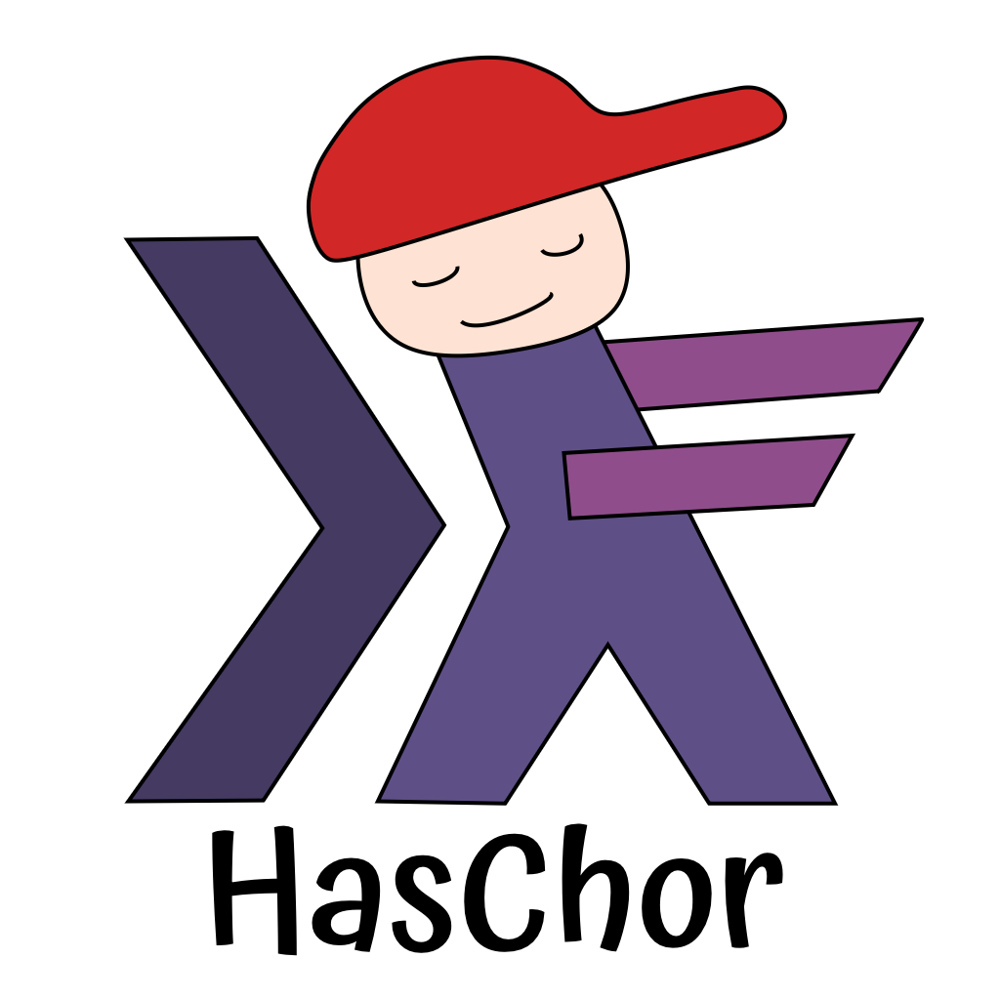

# HasChor



HasChor is a library for *functional choreographic programming* in Haskell, introduced by our [ICFP 2023 paper](https://doi.org/10.1145/3607849).
Choreographic programming is a programming paradigm where one writes a single program that describes the complete behavior of a distributed system and then compiles it to individual programs that run on each node.
In this way, the generated programs are guaranteed to be *deadlock-free*.

HasChor has the following features:
- HasChor provides a *monadic* interface for choreographic programming where choreographies are expressed as computations in a monad.
- HasChor is implemented as an *embedded* domain-specific language, enabling it to inherit features and libraries from Haskell for free.
- HasChor is built on top of *freer monads*, leading to a flexible, extensible, and concise implementation.

You can find the API specification [here](https://gshen42.github.io/HasChor/).

## Usage

### From Hackage

Simply list `HaChor` in your cabal `build-depends` field, and you're ready to go!

### From the Source Repository

Create a `cabal.project` file and list HasChor's repository as an external source:

``` cabal-config
packages:
    . -- your package

source-repository-package
    type: git
    location: https://github.com/gshen42/HasChor.git
    branch: main
```

Alternatively, if you want to make changes to HasChor, you could clone the repository and list it as a local package in the `cabal.project` file:

``` cabal-config
packages:
    .         -- your package
    ./HasChor -- path to HasChor repository
```

Either way, you can then list `HasChor` as a dependency in your `.cabal` file:

``` cabal-config
build-depends:
    , base
    , HasChor
```

## A Tour of HasChor

Let's say we want to implement a bookshop protocol with three participants: a buyer, a seller, and a deliverer.
The protocol goes as follows:

1. The buyer sends the title of a book they want to buy to the seller.
2. The seller replies to the buyer with the price of the book.
3. The buyer decides whether or not to buy the book based on their budget.
    1. If yes. The seller sends the title to the deliverer and gets back a delivery date, then forwards it to the buyer.
    2. If no. The protocol ends.

In HasChor, we could implement the bookshop protocol as the following program:

``` haskell
{-# LANGUAGE BlockArguments #-}
{-# LANGUAGE DataKinds      #-}
{-# LANGUAGE LambdaCase     #-}
{-# LANGUAGE TypeOperators  #-}

module Main where

import           Choreography       (Choreo, cond, locally, mkHttpConfig,
                                     runChoreography, type (@), (~>))
import           Control.Monad      (void)
import           Data.Proxy         (Proxy (..))
import           System.Environment (getArgs)

buyer :: Proxy "buyer"
buyer = Proxy

seller :: Proxy "seller"
seller = Proxy

deliverer :: Proxy "deliverer"
deliverer = Proxy

priceOf :: String -> Int
priceOf "Types and Programming Languages" = 80
priceOf "Homotopy Type Theory"            = 120
priceOf _                                 = 100

type Date = String

deliveryDateOf :: String -> Date
deliveryDateOf "Types and Programming Languages" = "2002-01-04"
deliveryDateOf "Homotopy Type Theory"            = "2013-04-20"
deliveryDateOf _                                 = "1970-01-01"

budget :: Int
budget = 100

bookshop :: Choreo IO (Maybe Date @ "buyer")
bookshop = do
    title <- buyer `locally` \un -> getLine
    title' <- (buyer, title) ~> seller

    price <- seller `locally` \un -> return $ priceOf (un title')
    price' <- (seller, price) ~> buyer

    decision <- buyer `locally` \un -> return $ (un price') <= budget
    cond (buyer, decision) \case
        True  -> do
            title'' <- (seller, title') ~> deliverer
            date <- deliverer `locally` \un -> return $ deliveryDateOf (un title'')
            date' <- (deliverer, date) ~> seller
            date'' <- (seller, date') ~> buyer
            buyer `locally` \un -> do
                putStrLn $ "The book will be delivered on " ++ (un date'')
                return $ Just (un date'')
        False ->
            buyer `locally` \un -> do
                putStrLn "The book is out of the budget"
                return Nothing

main :: IO ()
main = do
    [loc] <- getArgs
    void $ runChoreography cfg bookshop loc
    where
        cfg = mkHttpConfig
            [ ("buyer",     ("localhost", 4242))
            , ("seller",    ("localhost", 4343))
            , ("deliverer", ("localhost", 4444))
            ]
```

First, we define a set of locations we will use in the choreography.
Locations are HasChor's abstraction for nodes in a distributed system — they are just `String`s.
Since HasChor also uses locations at the type level, we turn on the `DataKinds` extension and define term-level `Proxy`s (`buyer`, `seller`, `deliverer`) for them.

Next, we have some auxiliary definitions (`priceOf`, `deliveryDateOf`, `budget`) for use in the choreography.

`bookshop` is a choreography that implements the bookshop protocol:

- `Choreo m a` is a monad that represents a choreography that returns a value of type `a`.
  The `m` parameter is another monad that represents the local computation that locations can perform.

- `a @ l` is a located value that represents a value of type `a` at location `l`.
  It's kept opaque to the user to avoid misusing values at locations they're not at.

- `locally :: Proxy l -> (Unwrap l -> m a) -> Choreo m (a @ l)` is the operator for performing a local compuation at a location.
  It takes a location `l`, a local computation `m a` with access to a unwrap function, and returns a value at `l`.
  The unwrap function is of type `Unwrap l = a @ l -> a`, which can only unwrap values at `l`.

- `(~>) :: (Proxy l, a @ l) -> Proxy l' -> Choreo m (a @ l')` is the operator for communication between two locations.
  It turns a value at `l` to the same value at `l'`.

- `cond :: (Proxy l, a @ l) -> (a -> Choreo m b) -> Choreo m b` is the operator for conditional execution.
  It takes a condition `a` at `l`, a function `a -> Choreo m b` denoting branches, and returns one of the branches.

Finally, we use `runChoreography :: Backend cfg => cfg -> Choreo m a -> String -> m a` to project the choreography to a particular location and run the resulting program.
`runChoreography` takes a *backend configuration* `cfg` which specifies the message transport backend that acutally handles sending and receiving messages. This example uses HasChor's HTTP backend, which implements the `Backend` typeclass. Alternate implementations of `Backend` could use different message transport mechanisms.

## More Examples

HasChor comes with a set of illustrative examples in the [examples](examples) directory.
They are built as executables alongside the HasChor library and can be run with:

``` bash
cabal run executable-name location
```

## Further Readings

- [Introduction to Choreographies](https://www.fabriziomontesi.com/introduction-to-choreographies/)
- [Pirouette: higher-order typed functional choreographies](https://dl.acm.org/doi/10.1145/3498684)
